<!--  -->
<h1 align="left">Hi there, I'm Rohit Pakhre</h1>

<h3 align="left">Full-Stack Developer | Connecting Logic With Creativity Through Code</h3>

I'm a passionate Full-Stack Developer focused on building scalable, user-friendly, and impactful web applications. My goal is to write clean, maintainable, and production-ready code that solves real-world problems. I thrive in environments that challenge me to learn, adapt, and grow.

<em>Always learning. Always building. Always improving.</em>

---

### Connect With Me

  &nbsp;
  &nbsp;
  

---

### My Current Focus
- Strengthening my skills in the **MERN Stack** (MongoDB, Express.js, React, and Node.js) while improving my knowledge of **MySQL**.
- Building practical full-stack projects and focusing on writing cleaner, more scalable, and user-friendly applications.
- Deepening my understanding of **Data Structures, Algorithms, and System Design**.

---

### My Tech Stack & Tools

<table>
  <tr>
    <td align="center" width="150"><strong>Frontend</strong></td>
    <td>
      
    </td>
  </tr>
  <tr>
    <td align="center" width="150"><strong>Backend</strong></td>
    <td>
      
    </td>
  </tr>
  <tr>
    <td align="center" width="150"><strong>Databases</strong></td>
    <td>
      
    </td>
  </tr>
  <tr>
    <td align="center" width="150"><strong>DevOps & Tools</strong></td>
    <td>
      
    </td>
  </tr>
</table>

---

### Skill Galaxy + Project Constellation

  <picture>
    <source
      media="(prefers-color-scheme: dark)"
      srcset="./assets/skyline-dark.svg"
    />
    <source
      media="(prefers-color-scheme: light)"
      srcset="./assets/skyline-light.svg"
    />
    
  </picture>

  

